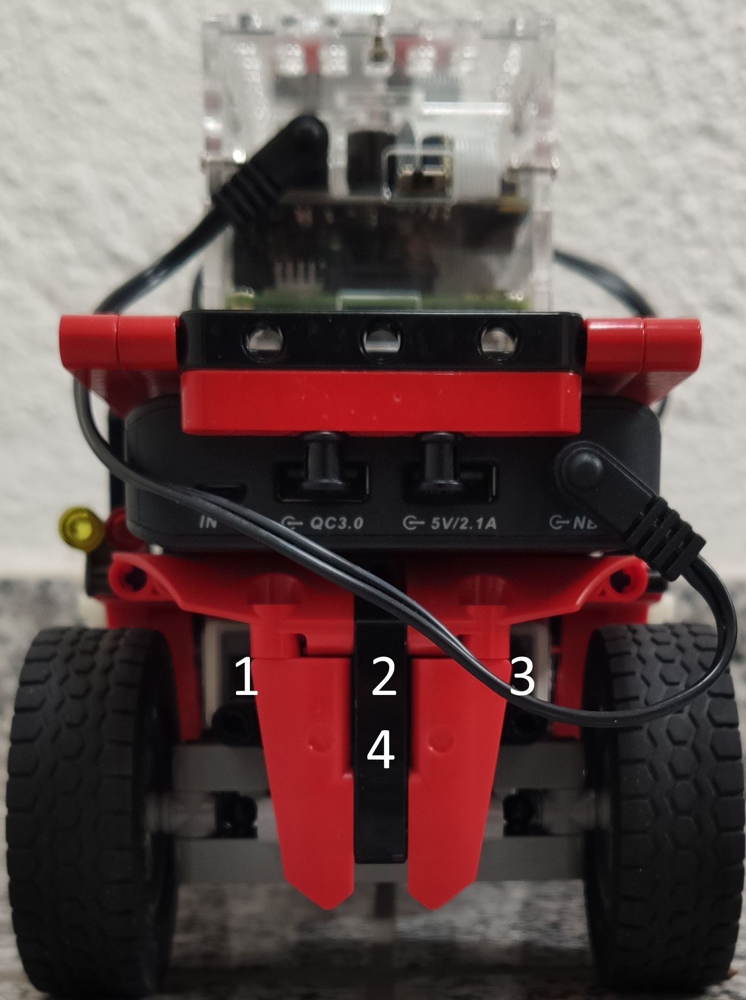

# T3_3101 - Reinforced Learing/Q-Learning: Swarmrobot parking

Controlls a unit of the Swarm Robotics platform of the DHBW Bad Mergentheim

## Quickguide

To calibrate the whole robot, run `$ ./calibrate.py` and follow the instructions.

To learn parking (or fill the current q-table) run `$ ./simulator.py` and enter 'start'.
It is recommended to learn parking before using the parking programm, but it is not necessary.

To use the swarmrobot with the parking programm, run `$ ./exhibition.py` and enter 'start'.

To control the swarmrobot manually, run `$ ./meassure.py`. Further instructions will be shown.

## Detailed Guide

*`TBD`*

## Command-line Argument

### simulator.py

| Option       | Usage |
| ------------ | ----- |
| random       | Alias for random_start |
| random_start | The Simulator will use a random start position for learning parking |

### exhibition.py

| Option             | Usage |
| ------------------ | ----- |
| administrator_mode | More seetings and menue points will be shown. Comant to exit the software will be shown. |
| administratormode  | Alias for administrator_mode |
| park_lot_detection | The swarmrobot will detect and follow a black line or parkour until it meets an intersection with a red parking lot. The swarmrobot tryes to park into the parking lot. After about 10 seconds, the robot will follow the black for about 2 seconds and turn. |
| parklotdetection   | Alias for park_lot_detection
| preview_mode       | Display needed! More details and a picture of the camera view will be displayed. |
| previewmode        | Alias for preview_mode |
| debug_mode         | Display needed! Additional information and pictures will be displayed. Warning the debug_mode could cause crahes! |
| debugmode          | Alias for debug_mode |

## Requierements

Hardware:
- Raspberry Pi 3b
- BrickPi3
- 4 Lego Motors
- (mobile) Power supply
- Raspberry Pi Camera v2.1
- Optional: Display with 1280x720 or higher for debug- and preview-mode

Software:
- Raspbian
- Python 3.5.3 or higher
- Python packages (see `requierements.txt`):
    - numpy 1.13.3
    - scikit-build  0.11.1
    - opencv-python 4.4.0.42
    - pyzbar 0.1.9
    - scipy 0.18.1
    - scikit-image 0.15.0
    - spidev 3.4
- Git version compatible with github.com is recommended
- Recommended terminal size: 115 x 25 or higher

## Configuration

### Motor Ports (Hardware)

| Motor function  | Port | Number in picture |
| --------------- | ---- | ----------------- |
| Fork lift motor | A    | 3 |
| Fork tilt motor | B    | 1 |
| Drive motor     | C    | 4 |
| Steer motor     | D    | 2 |

  
Numbered motors (klick to expand)

  

### exhibition_parking.conf

Contains the settings from the exhibition or simulator software in json like format. These settings could also be set in the exhibition or simulator user interphase. This file will be auto generated, if it doesn't exsist. Additional to the settings, there are to more values that need to be change manually in the file, if you want to change them, 'alpha' and 'y'. Both are paremeter for the q-learning.

Example with default values:

`{"language": "english", "qtable_name": "default", "alpha": 1.0, "y": 0.95, "direction": "FORWARD", "action": "explore", "color": "True"}`

Explanation:
- language describes the current menue language. This can be "english" or "german".
- qtable_name describes the file name of the q-table without file extension, of the file containing the current q-table.
- alpha describes the alpha exploration rate. This can be a float value betwenn 0.0 and 1.0.
- y describes the y exploration rate. This can be a float value betwenn 0.0 and 1.0.
- direction describes the parking direction. This can be "FORWARD" or "BACKWARD" and says if the swarmrobot parks forward into a parking lot or backward.
- action describes if the swarmrobot learns parking or uses it's q-table to park. This value can be "explore" to learn or "utilize" use the q-table.
- color is a boolean value, ans says if the output is colored or not. This value can be "True" or "False".

### constants.py

!Warning! It is not recommende to change constants, this could cause demage!

Contains important values to controll the swarmrobot and for the software behavior. The constats are described in the file itself. Be carefull if changing constants against the recommendation, this could cause demage.

## Disclamer

THE SOFTWARE IS PROVIDED "AS IS", WITHOUT WARRANTY OF ANY KIND!

## Files

### Created by my self:

- calibrate.py
- constants.py
- exhibition.py
- meassrue.py
- parking_learner.py
- parkindirection.py
- print_logo.py
- programm_type.py
- simulator.py
- test.py

### Copied fiels from swarmrobot, based on this repo: https://github.com/1Basileus/Swarmrobotlib

- bar_code_detection.py
- brickpi3.py
- pidcontroller.py
- qr_detection.py
- stop.py

### Modified fiels from swarmrobot based on this repo: https://github.com/1Basileus/Swarmrobotlib

- intersection_detection.py
- line_tracking.py
- motor.py
- navigation.py
- parking_space_detection.py
- qr_test.py
- swarmrobot.py
- turn_assistant.py

###### Author: Lukas Loeffler